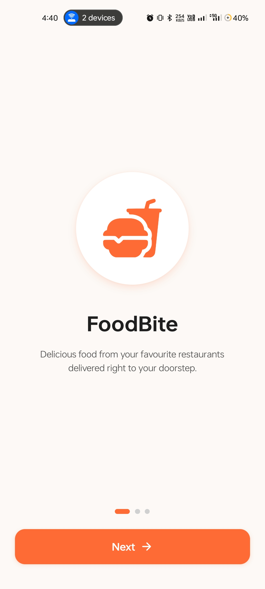
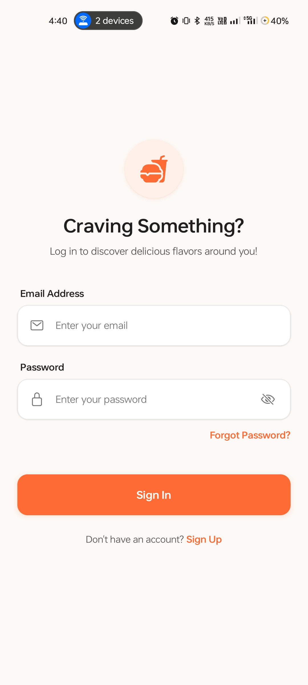
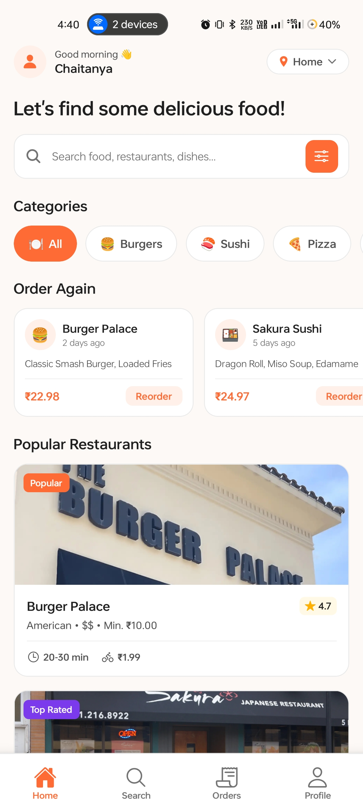
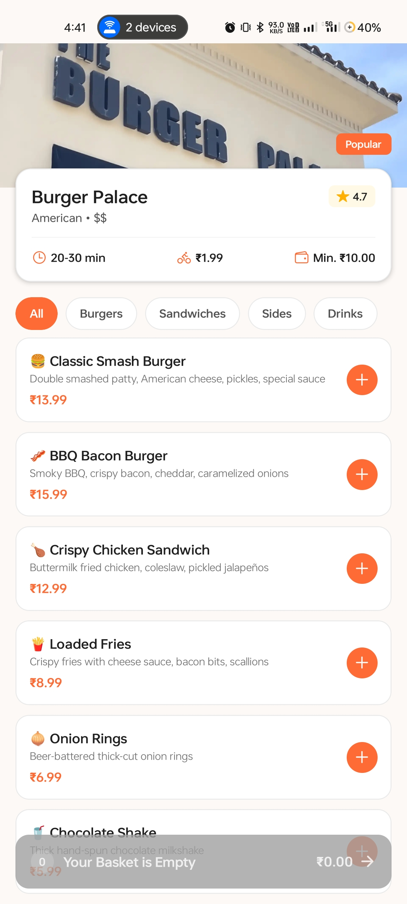
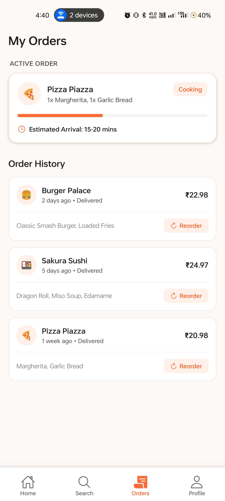
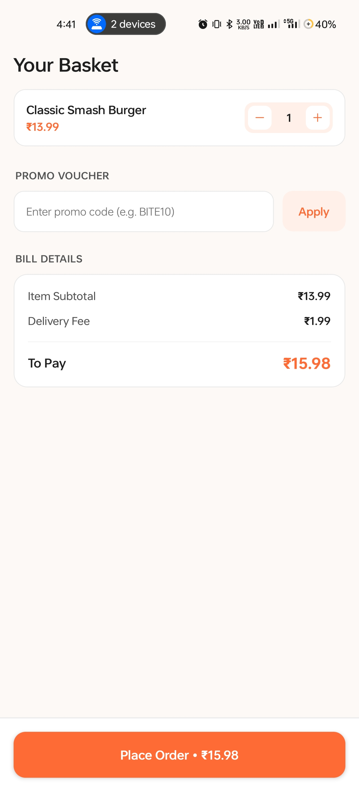
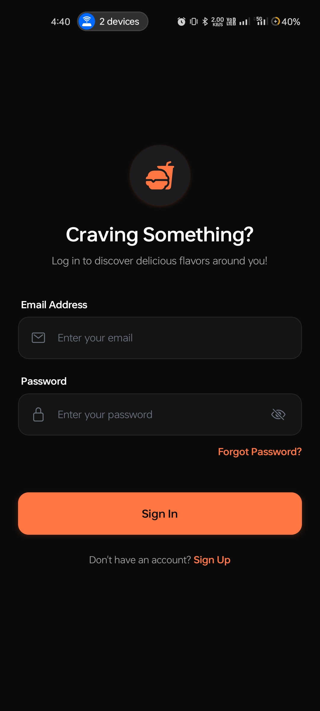
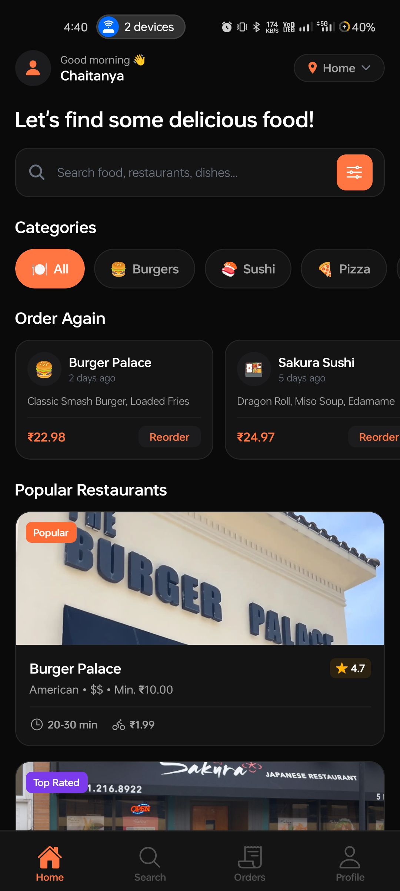
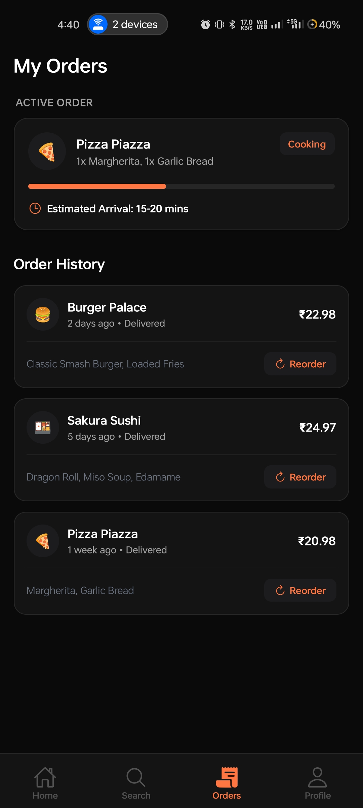

# Food Delivery App

## Project Overview

Food Delivery App built using Expo React Native and React Navigation demonstrating:

- Stack Navigation
- Bottom Tabs
- Drawer Navigation
- Authentication Flow
- Deep Linking
- AsyncStorage Persistence

## Tech Stack

- Expo
- React Native
- TypeScript
- React Navigation
- AsyncStorage

## Structure

```
src
│
├── components
│   ├── CustomDrawerContent.tsx
│
├── constants
│   └── restaurants.ts
│
├── context
│   ├── AuthContext.tsx
│   └── CartContext.tsx
|   └── ThemeContext.tsx
│
├── navigation
│   ├── AuthNavigator.tsx
│   ├── MainTabs.tsx
│   ├── ProfileDrawer.tsx
│   ├── RestaurantStack.tsx
│   ├── RootNavigator.tsx
│   └── linking.ts
│
├── screens
│   ├── auth
│   │   └── LoginScreen.tsx
│   │
│   ├── onboarding
│   │   └── OnboardingScreen.tsx
│   │
│   ├── home
│   │   ├── HomeScreen.tsx
│   │   ├── RestaurantDetailScreen.tsx
│   │   └── CartScreen.tsx
│   │
│   ├── tabs
│   │   ├── SearchScreen.tsx
│   │   ├── OrdersScreen.tsx
│   │   └── ProfileScreen.tsx
│   │
│   └── drawer
│       ├── MyOrdersScreen.tsx
│       ├── SettingsScreen.tsx
│       └── HelpScreen.tsx
│
├── theme
│   └── theme.ts
│
├── types
│   ├── navigation.ts
│   └── models.ts
|   └── index.ts
│
├── utils
│   └── storage.ts
│
└── App.tsx
```

## Deep Linking

foodapp://restaurant/:restaurantId

Example:

foodapp://restaurant/1

## Installation

```bash
npm install

npx expo start
```

## Features

- Authentication
- Drawer Navigation
- Orders Badge
- Cart Management
- Search Restaurants
- Deep Linking

## Screenshots

### Demo Video


### App Screenshots

<table>
  <tr>
    <td></td>
    <td></td>
    <td></td>
  </tr>
  <tr>
    <td></td>
    <td></td>
    <td></td>
  </tr>
  <tr>
    <td></td>
    <td></td>
    <td></td>
  </tr>
</table>
